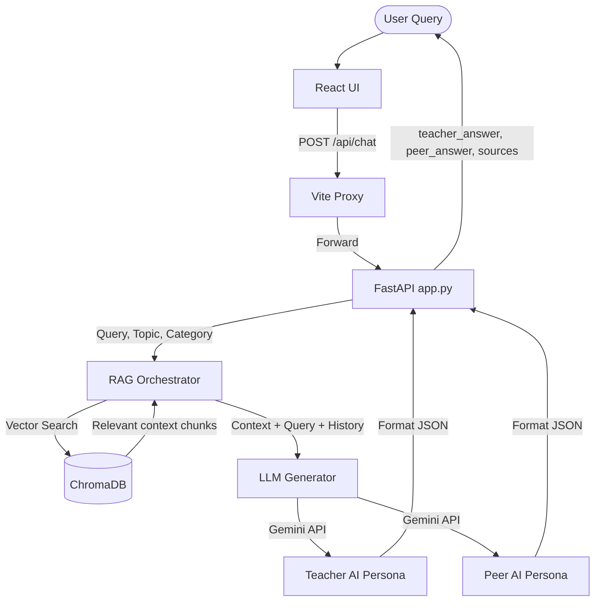

# Learniverse AI

Learniverse AI is an interactive, state-of-the-art educational platform designed to help students master **Data Structures, Algorithms (DSA)**, and **Calculus**. 

Powered by a **Dual-Persona Retrieval-Augmented Generation (RAG)** pipeline, Learniverse AI pairs you with two distinct virtual mentors who ground their answers in academic textbooks to guide you through coding challenges and mathematical proofs.

---

## Key Features

* **Dual-Persona Mentoring:**
  * **Teacher AI:** Provides structured, precise, step-by-step textbook explanations utilizing correct mathematical and computer science terminology.
  * **Peer AI:** Explains complex concepts in simple, intuitive, and relatable ways using friendly analogies, acting like your smart study partner.
* **Grounded Textbook Reference (RAG):** Answers are strictly grounded in university-level reference material (such as *Active Calculus* and *Open Data Structures*), preventing hallucinations.
* **Citations & Sources:** Every response lists the specific textbook chapters and sections referenced during generation.
* **Interactive Question Cards:** Solve topic-specific coding and math problems, get hints, and submit your answers for evaluation.
* **Sleek, Modern UI:** A fully responsive glassmorphism dashboard built with React, TailwindCSS, and dark mode aesthetics.

---

## Technology Stack

| Layer | Technology |
|---|---|
| **Frontend** | React (TypeScript), Vite, TailwindCSS, Shadcn/UI, Lucide Icons |
| **Backend** | FastAPI, Python, Uvicorn |
| **Vector Search** | ChromaDB (Persistent Vector DB) |
| **Embeddings** | SentenceTransformers (`all-mpnet-base-v2`) |
| **Generative LLM** | Google Gemini API (`gemini-2.5-flash`) |

---

## Project Architecture

```
learniverse-ai/
├── src/                    # React Frontend
│   ├── components/         # Reusable UI & Layout Components
│   │   ├── ConversationBox.tsx  # Chatbox interface with AI mentors
│   │   ├── QuestionCard.tsx     # Problem-solving card
│   │   └── ui/             # Shadcn UI primitives
│   ├── pages/              # App Pages (Dashboard, Detail, About)
│   ├── services/           # Data & Topic Fetching Services
│   └── App.tsx             # React Router configuration
├── backend/                # FastAPI Backend
│   ├── app.py              # FastAPI Router & Endpoint Server
│   ├── chroma_db/          # Persistent Vector DB files
│   ├── requirements.txt    # Python dependencies
│   ├── scraper/            # Web Crawlers & parsers for textbooks
│   └── rag/                # RAG Pipeline Logic
│       ├── retriever.py    # ChromaDB context retriever
│       ├── generator.py    # Dual-persona prompt engineering & Gemini API
│       └── calculus_pipeline.py # Core RAG orchestrator
├── vite.config.ts          # Vite Configuration with API reverse proxy
└── README.md
```

---

## Installation & Setup

### Prerequisites
* **Node.js** (v18+)
* **Python** (v3.10+)
* **Gemini API Key** (Get one from [Google AI Studio](https://aistudio.google.com/))

### 1. Backend Setup

1. Navigate to the backend directory:
   ```bash
   cd backend
   ```
2. Create and activate a virtual environment:
   ```bash
   python -m venv venv
   # On Windows:
   .\venv\Scripts\activate
   # On macOS/Linux:
   source venv/bin/activate
   ```
3. Install dependencies:
   ```bash
   pip install -r requirements.txt
   ```
4. Create a `.env` file inside the `backend` folder and add your Gemini API Key:
   ```env
   GEMINI_API_KEY=your_gemini_api_key_here
   ```
5. Start the FastAPI server on port 8000:
   ```bash
   python -m uvicorn app:app --reload --port 8000
   ```

### 2. Frontend Setup

1. Open a new terminal in the project root directory (`learniverse-ai-main`) and install npm dependencies:
   ```bash
   npm install
   ```
2. Start the Vite development server:
   ```bash
   npm run dev
   ```
3. Open `http://localhost:8080` in your web browser.

---

## How the RAG Pipeline Works



1. **Query & Category:** The React UI triggers `/api/chat`, passing the query, topic, and category.
2. **Context Retrieval:** `retriever.py` encodes the query using `SentenceTransformer` and queries the appropriate ChromaDB collection (`dsa_books` or `math_books`).
3. **Dual Prompting:** `generator.py` injects the retrieved context and history into structured instructions for the **Teacher** and **Peer** personas.
4. **Answer Generation:** The Gemini model (`gemini-2.5-flash`) generates the customized responses, which are packaged along with source details and returned to the frontend.

---

## License
This project is open-source and available for educational purposes.